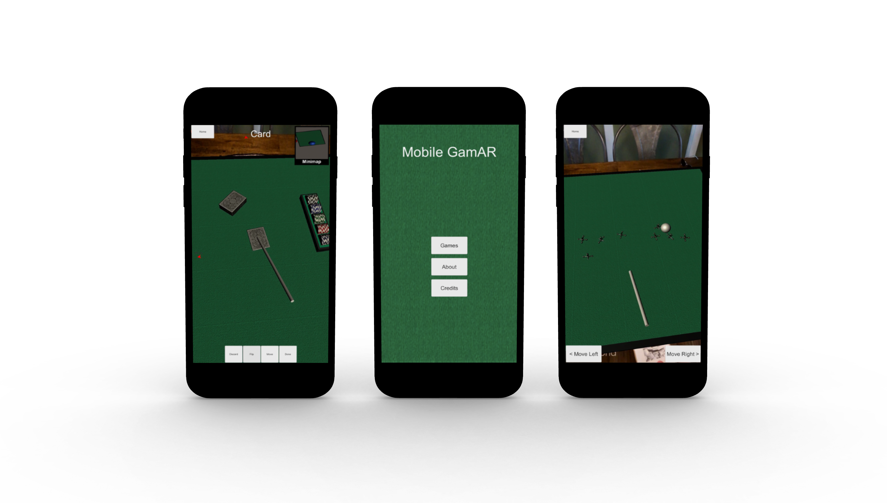

# Mobile-GamAR

| [Explore the Docs 📖](https://github.com/samsilverman/Mobile-GamAR/wiki) | [View Demo 🎥](https://youtu.be/0zFvWrOs-L8) | [Report Bug 🐛](https://github.com/samsilverman/Mobile-GamAR/issues) | [Request Feature 💻](https://github.com/samsilverman/Mobile-GamAR/issues) |
|--------------------|-------------|--------------|-------------------|



Mobile GamAR is a mobile augmented reality application that allows users to conveniently and intuitively play virtual board and card games. With the aid of a mobile device, users can control a variety of game pieces for Poker and Jacks.

### Built With

Mobile GamAR was built with:

* [Unity](https://unity.com)
* [PTC Vuforia Engine](https://library.vuforia.com/articles/Training/getting-started-with-vuforia-in-unity.html)

## Getting Started

These instructions will get you a copy of the project up and running on your local machine.

### Prerequisites

You will need to install the following software to run Mobile GamAR:

* [Unity](https://unity3d.com/get-unity/download/archive) - Version 2019.3.12f1 (Newer versions may work but untested).

You will need the following accounts set up:

* [Vuforia Developer Account](https://developer.vuforia.com/vui/auth/login)
* [Apple ID](https://support.apple.com/en-us/HT204316)

You will need to print a variety of AR targets used in the project. These targets can be found [here](Misc/ImageTargets.pdf). The following image targets are used:

* Stones
* Tarmac
* Vortex

**NOTE:** Image targets work best when kept straight and crease-free. It is best if the image targets are glued to a hard surface like cardboard.

### Installation

1. Clone the repository.

```bash
git clone https://github.com/samsilverman/Mobile-GamAR.git
```

2. Create a Vuforia license key. Steps to do so can be found [here](https://library.vuforia.com/articles/Training/Vuforia-License-Manager.html).

3. Add the license key to Unity. Specifically, in `Window > Vuforia Configuration > App License Key` add the license key from Vuforia.

4. Set project build settings. Go to `File > Build Settings...`. From the Build Settings menu, select the `iOS` platform. Ensure that all the scenes are in the `Scenes To Build` window with the following order:

| Scene Name      | Build Index |
| ----------- | ----------- |
| Scenes/MainMenuScene      | 0       |
| Scenes/PlayingCardsScene   | 1        |
| Scenes/JacksScene   | 2        |

5. Build the project. Select `Build And Run` (you can save the build however you like). In XCode, build the project to your iOS device.

## Usage

Currently, Mobile GamAR supports two games: cards and jacks. The primary means for interacting with the virtual objects is through the hand toolbar (vortex image target).


The hand toolbar allows for the selection and manipulation of a variety of game pieces.

*For more information, please refer to the [Documentation](https://github.com/samsilverman/Mobile-GamAR/wiki).*

## Contribute

Contributions are what make the open-source community such an amazing place to learn, inspire, and create. Any contributions you make are **greatly appreciated**.

1. Fork the Project
2. Create your Feature Branch

```bash
git checkout -b feature/AmazingFeature
```

3. Commit your Changes

```bash
git commit -m 'Add some AmazingFeature'
```

4. Push to the Branch

```bash
git push origin feature/AmazingFeature
```

5. Open a Pull Request

## Contact

Sam Silverman - [@sam_silverman](https://twitter.com/sam_silverman) - [samuel.silverman@columbia.edu](mailto:samuel.silverman@columbia.edu)

Project Link: [https://github.com/samsilverman/Mobile-GamAR](https://github.com/samsilverman/Mobile-GamAR)

## Acknowledgements

* [Free Little Games Asset Pack](https://assetstore.unity.com/packages/3d/props/free-little-games-asset-pack-125089)
* [Off Screen Target Indicator](https://assetstore.unity.com/packages/tools/gui/off-screen-target-indicator-71799)
* [Space Robot Kyle](https://assetstore.unity.com/packages/3d/characters/robots/space-robot-kyle-4696)
* [Threed.io](https://threed.io)
* [Best README Template](https://github.com/othneildrew/Best-README-Template)

Mobile GamAR was a final project for the course [COMS 4172: 3D User Interfaces and Augmented Reality](http://www.cs.columbia.edu/~feiner/courses/csw4172/) taught by Prof. Steven K. Feiner.

Original Project Team:

* [Sam Silverman](https://github.com/samsilverman)
* [Irene Chen](https://github.com/irenekchen)
* [Bingtang Wang](https://github.com/EricWang777)
* [Jianjin Xu](https://github.com/AtlantixJJ)
